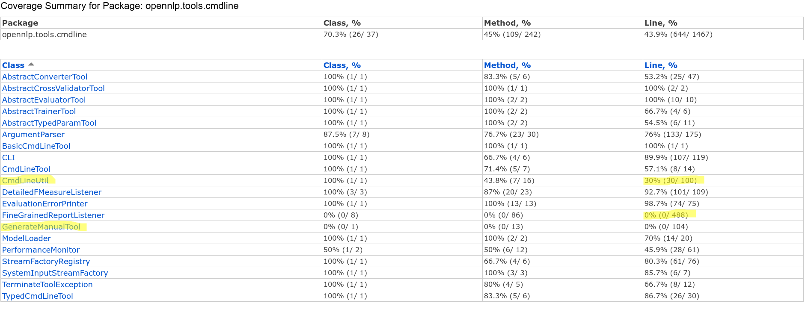
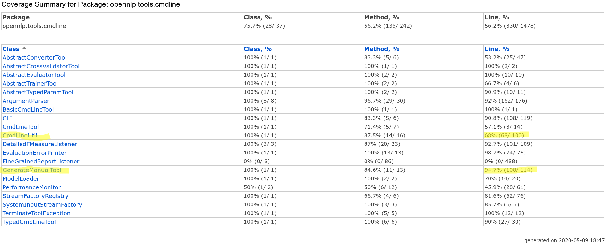

# Homework3: Structural Testing
Shrijith Saraswathi Venkatramana | shrijits@uci.edu

## First, describe what structural testing is and motivate why it is important.

Structural testing is a "white-box testing" method, that is a set of testing
techniques that operate on the actual code base of a software system. In contrast
to "black-box testing" methods, structural testing works on the actuality of the
system rather than ideal behavior.

**Motivation:** Of the multiple reasons to use strutural testing, some of them are
listed below:

1. Tells us what parts of the actual code base haven't received enough testing
2. Runs automatically, and well-integrated with major IDEs


## Code coverage for the existing codebase

### IntelliJ Code Coverage Report 
The full IntelliJ report can be browsed **before** any changes were made [here](coverage-report-before/index.html):


### Summary of the report 

The basic summary is as follows:


### Documenting some uncovered parts of the test suite



The first part that I focused on was the `CmdLineUtil` module. This is a set of procedures for ensuring safety and sanity of the commandline handling mechanism. The line coverage is a only 30% (30/100).

Another part of the system that is totally not covered is the `GenerateManualTool` which has automatic mechanisms for collecting and generating an XML report on the CLI interface.

## Increasing code-coverage


I created a new set of tests (15+) for testing various aspects of commandline utilities:

+ Covering various error cases when dealing with files/folders
+ Sanity checking the various commandline parameters
+ Dealing with Training Parameters and Write Models

```
package opennlp.tools.cmdline;


import opennlp.tools.chunker.ChunkerFactory;
import opennlp.tools.chunker.ChunkerME;
import opennlp.tools.chunker.ChunkerModel;
import opennlp.tools.cmdline.chunker.ChunkerTrainerTool;
import opennlp.tools.util.TrainingParameters;
import opennlp.tools.util.model.ModelUtil;
import org.junit.Assert;
import org.junit.Test;

import java.io.BufferedWriter;
import java.io.File;
import java.io.FileWriter;
import java.io.IOException;

public class CmdLineUtilTest {
    @Test(expected = TerminateToolException.class)
    public void testCIFDoesntExist(){
        File existingFile = new File("sampledata2");
        CmdLineUtil.checkInputFile("sampledata2", existingFile);
    }

    @Test
    public void testCIFValidFile(){
        File existingFile = new File("sampledata");
        CmdLineUtil.checkInputFile("sampledata", existingFile);
    }

    @Test(expected = TerminateToolException.class)
    public void testCIFIsADirectory(){
        File directory = new File("src");
        CmdLineUtil.checkInputFile("src", directory);
    }

    @Test(expected =  TerminateToolException.class)
    public void testCIFNoPermissions(){
        File fstab = new File("unreadablefile");
        CmdLineUtil.checkInputFile("unreadablefile", fstab);
    }

    @Test(expected = TerminateToolException.class)
    public void testOutputDir(){
        File directory = new File("src");
        CmdLineUtil.checkOutputFile("src", directory);
    }

    @Test(expected = TerminateToolException.class)
    public void testOutputNoPermission(){
        File fstab = new File("unreadablefile");
        CmdLineUtil.checkOutputFile("unreadablefile", fstab);
    }

    @Test(expected = TerminateToolException.class)
    public void testOutputInvalidParent(){
        File fstab = new File("nonexistentplace/newfile");
        CmdLineUtil.checkOutputFile("nonexistent", fstab);
    }

    @Test(expected = TerminateToolException.class)
    public void testopenInFile(){
        File invalidfile = new File("sampledata2");
        CmdLineUtil.openInFile(invalidfile);
    }

    @Test(expected = TerminateToolException.class)
    public void testcreateInputStreamFactory(){
        File invalidfile = new File("sampledata2");
        CmdLineUtil.openInFile(invalidfile);
    }


    @Test
    public void testGetParameterIndex() {
        String param="-name";
        String[] args = {"-name", "b", "c"};
        Assert.assertEquals(0, CmdLineUtil.getParameterIndex("-name", args));

    }

    @Test
    public void testGetParameterIndex2() {
        String param="-name";
        String[] args = {"name", "b", "c"};
        Assert.assertEquals(-1, CmdLineUtil.getParameterIndex("-name", args));

    }

    @Test
    public void testGetParameter1() {
        String param="-name";
        String[] args = {"-name", "b", "c"};
        Assert.assertEquals("b", CmdLineUtil.getParameter(param, args));
    }

    @Test
    public void testGetParameter2(){
        String param="-noname";
        String[] args = {"-name", "b", "c"};
        Assert.assertEquals(null, CmdLineUtil.getParameter(param, args));
    }

    @Test
    public void testGetIntParameter(){
        String param="-number";
        String[] args = {"-name", "abc"};
        Assert.assertEquals(null, CmdLineUtil.getIntParameter(param, args));
    }

    @Test
    public void testHandleDoubleParameter(){
        String param="-number";
        String[] args = {"-name", "abc"};
        Assert.assertEquals(null, CmdLineUtil.getDoubleParameter(param, args));
    }

    @Test(expected = TerminateToolException.class)
    public void testCheckLanugageCode(){
        String randomlang = "random101";
        CmdLineUtil.checkLanguageCode(randomlang);
    }

    @Test
    public void testContainsParam(){
        String contains = "-invalid";
        String[] args = {"-name", "a", "-ab", "b", "-c"};
        Assert.assertEquals(false, CmdLineUtil.containsParam(contains, args));
    }

    @Test(expected = TerminateToolException.class)
    public void testhandleStdinIoError(){
        try {
            BufferedWriter bw = new BufferedWriter(new FileWriter("/"));
        } catch (IOException e) {
            CmdLineUtil.handleStdinIoError(e);
        }
    }

    @Test(expected = TerminateToolException.class)
    public void testhandleCreateObjectStreamError(){
        try {
            BufferedWriter bw = new BufferedWriter(new FileWriter("/"));
        } catch (IOException e) {
            CmdLineUtil.handleCreateObjectStreamError(e);
        }
    }

    @Test
    public void testloadTrainingParameters(){
        CmdLineUtil.loadTrainingParameters("sampledata", true);
    }

    @Test(expected = TerminateToolException.class)
    public void testWriteModel(){

        ChunkerTrainerTool c = new ChunkerTrainerTool();
        String[] args = {};
        c.run(null, new String[]{"ParserTrainer", "-headRules", "headRulesFile", "-parserType",
                "TREEINSERT", "-lang", "English", "-model", "", "-data", "sampledata"});
    }
}
```

The manual generation functionality is invoked with a valid xml file and ensured to be existing:

package opennlp.tools.cmdline;

import org.junit.Test;

public class testGenerateManualTool {

    @Test
    public void testManualTool() {
        String[] args = {"output.xml"};
        try {
            GenerateManualTool.main(args);
        } catch (java.io.FileNotFoundException e) {
            System.out.print("Output file not found");
        }
    }
}


The manual generation mechanism is tested like so:

```
package opennlp.tools.cmdline;

import org.junit.Assert;
import org.junit.Test;

import java.io.File;

public class testGenerateManualTool {

    @Test
    public void testManualTool() {
        String[] args = {"output.xml"};
        try {
            GenerateManualTool.main(args);
        } catch (java.io.FileNotFoundException e) {
            System.out.print("Output file not found");
        }
        File f = new File("output.xml");
        double bytes = f.length();

        Assert.assertTrue("File is populated", bytes > 0);
    }
}
```

### Result



+ CmdlineUtil: 30/100 -> 68/100 -> +38 lines
+ GenerateManualTool: 0/114 -> 108/114 -> +108 lines

**In total 146 new lines were added to code coverage**