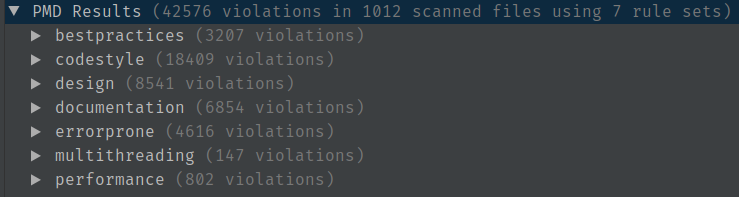

# Homework 5 - Static Analyzers and CI
Shrijith Saraswathi Venkatramana (shrijits@uci.edu)

## Static Analyzers 

### First, describe the goals, purposes, and use of static analysis tools (i.e., static analyzers). 

The purpose of static analyzers is the process of analysing the source code for software in an
automated way to point out various *possible* structural or qualitative issues with it. This techinque is
in contrast to dynamic or runtime analysis. Static analysis may automatically find out possible issues
with adherence to standard coding practices, performance, readability, and more. 

The use of static analysis generally happens in the context of a build or continuous
integration pipeline, where static analysis checks have a major input in deciding whether
a set of changes are permitted to pass to the next state of the pipeline. 

### Use two different static analyzers on your project 

#### PMD

Running PMD on the whole source code resulted in 42,576 violations.

The results was bifurcated into 7 categories:

 

I thought it'd be useful to visualize these numbers:

;`

...was marked as a bug by PMD with the following description:

> System.(out|err) are usually intended for debugging purposes and can remain in the codebase even in production code. By using a logger one can enable/disable this behaviour at will (and by priority) and avoid clogging the Standard out log.
                 
This is generally good advice, especially in the world of centralized servers infrastructure of the cloud, where writing a lot of content into
stdout or files can be a major bottleneck to application performance. Setting up a logger allows for finetuned yet global control over
what is logged, where, when and how.

#### PMD - design - CyclomaticComplexity

PMD guide describes CyclomaticComplexity rule as follows:

> The complexity of methods directly affects maintenance costs and readability. Concentrating too much decisional logic in a single method makes its behaviour hard to read and change.
> Cyclomatic complexity assesses the complexity of a method by counting the number of decision points in a method, plus one for the method entry. Decision points are places where the control flow jumps to another place in the program. As such, they include all control flow statements, such as ‘if’, ‘while’, ‘for’, and ‘case’.
> Generally, numbers ranging from 1-4 denote low complexity, 5-7 denote moderate complexity, 8-10 denote high complexity, and 11+ is very high complexity. By default, this rule reports methods with a complexity >= 10. Additionnally, classes with many methods of moderate complexity get reported as well once the total of their methods’ complexities reaches 40, even if none of the methods was directly reported.
> Reported methods should be broken down into several smaller methods. Reported classes should probably be broken down into subcomponents.

The following function was marked for having Cyclomatic complexity > 10:


```Java
  private static void checkProxyInterfaces(Class<?>... proxyInterfaces) {
    for (Class<?> proxyInterface : proxyInterfaces) {
      if (null != proxyInterface) {
        if (!proxyInterface.isInterface())
          throw new IllegalArgumentException("proxy interface is not an interface!");

        // all checks should also be performed for super interfaces

        Method[] methods = proxyInterface.getMethods();

        if (methods.length == 0)
          throw new IllegalArgumentException("proxy interface must at least declare one method!");

        for (Method method : methods) {

          // check that method names start with get
          if (!method.getName().startsWith("get") && method.getName().length() > 3)
            throw new IllegalArgumentException(method.getName() + " method name does not start with 'get'!");

          // check that method has zero arguments
          if (method.getParameterTypes().length != 0) {
            throw new IllegalArgumentException(method.getName()
                + " method must have zero parameters but has "
                + method.getParameterTypes().length + "!");
          }

          // check return types of interface
          Class<?> returnType = method.getReturnType();

          Set<Class<?>> compatibleReturnTypes = argumentFactories.keySet();

          if (!compatibleReturnTypes.contains(returnType)) {
            throw new IllegalArgumentException(method.getName()
                + " method must have compatible return type! Got "
                + returnType + ", expected one of " + compatibleReturnTypes);
          }
        }
      }
    }
  }
```

#### SpotBugs - Internationalization - Reliance on default encoding

The following code was marked:

`System.setErr(new PrintStream(myOut));`

The explanation given was:

> Found a call to a method which will perform a byte to String (or String to byte) conversion, and will assume that the default platform encoding is suitable. This will cause the application behaviour to vary between platforms. Use an alternative API and specify a charset name or Charset object explicitly.

This message becomes more and more useful, as we consider that software services communities all over the globe with newer languages coming into the mainstream as reach of technology increases.


#### SpotBugs - Correctness - Possible null pointer dereference 

The following piece of code was marked as a possible bug:

```java
    if (dictionaryMeta == null || !dictionaryMeta.toFile().canRead()) {
      throw new FileNotFoundException("Could not read dictionary metadata: " + dictionaryMeta.getFileName());
    }
```

...with the explanation:

>Possible null pointer dereference: There is a branch of statement that, if executed, guarantees that a null value will be dereferenced, which would generate a NullPointerException when the code is executed. Of course, the problem might be that the branch or statement is infeasible and that the null pointer exception can't ever be executed; deciding that is beyond the ability of SpotBugs.

On analysis, this is indeed a genuine bug, because if `dictionaryMeta` is null, then trying to invoke a method of
`dictionaryMeta` is an invalid operation.

### Comparison

After preliminary examination, following
are overlapping (conceptual) categories in the two tools (PMD and SpotBugs):

1. Performance - Performance
2. Best Practices - Dodgy Code

Some conceptually non-overlapping categories are:

1. Internationalization (provided by SpotBugs)
2. Documentation (provided by PMD)

In a more detailed view, the types of issues found are of a varied types, although there's
some overlap.

First of all, the number of errrors found are *totally* different:  PMD's 42,576 versus SpotBug's 383.

By this fact alone, we can guess that PMD offers more value overall.

For example, PMD's design class of issues seem particulary important from a programmer
understandability point of view, with issues such as cyclomatix complexity, cognitive complexity, etc.

On the other hand, SpotBugs has a nicer UI, with a split-window interface, where
one can drill down from generic categories -> Issues -> highlighted code -> Top level Explanation -> Detailed Explanation.

In terms of the *quality* of particular descriptions, I found both to be on equal levels, both were concise and unambiguous.
 
A comparison of two descriptions for the common case of unused variables are shown below:

#### SpotBugs: "Dead store to local variable"

From the manual:

> This instruction assigns a value to a local variable, but the value is not read or used in any subsequent instruction. Often, this indicates an error, because the value computed is never used.

#### PMD: "UnusedLocalVariable"

> Detects when a local variable is declared and/or assigned, but not used.


## Continuous Integration

### 


### Travis configuration

I have added my comments to the configuration file from the original OpenNLP repository.
```yaml
language: java
os: linux
jdk: openjdk8

# Super-user privileges not required for build
sudo: false

# Ensure security through PKI 
env:
  global:
   # The next declaration is the encrypted COVERITY_SCAN_TOKEN, created
   # via the "travis encrypt" command using the project repo's public key
   - secure: "WLRKO/tD2rFN+a/HKSf9iZkaMaFE8/luXcJCXGfewoHysF7LgIJ76AN9HY50woVJykl+T/tEhK5c/+H/IKO5zH8Rvz/Q9XxPTvUTOwH7oFOHCQ66mKTvn27Z4fp+JbkPKJuhWDUzPvS/Alo3wE70UELnFRTFoRsemfNNa95uPJobfx5deOfX80mipHOn16dA1q8LuzQa6iF2HIVuh7ygLleTV0cDJyXmIlg3EbKGEitozIv0WkwALrBjLS7KmCcXTKxXqCm1Be2MFRoh9ab2bEooXlv2zRh2wT0c04RckFm1AJGpGQelXLl3NxxcRJSpIN9OTkpVUfwm28TIXk2SzdgPMrP11yFK/DPKTv0jwyk1bFrmZMMso5Y2rP6wjNEtw5ExYSpk3xebcieLJwXhCwkkWAT3DdAAeXO5z4Nf36lryjRgqvlsVF1ofqAK5Sh+qH93/TJOE+hVEj74xUT9pVaxemY61ymvSt8L21XkUsp8T5ILq9jWoaMQCaAwZIaJiHXYjQhmsrFRkNaY4cl9AUGwpHmm750uqhmoVfuJzQg5/vGMZ0LWeCgR9qsG5MG0yijE8ghExUOe7R4gcNAJW2XOfjzMTy74jdsJbsJPUeci/R4wzrXTSCQVJ5nj2LhBF6HyqPyUrIV2MB14gAIItc1LASuB1GLkGoXjIdt0HN8="

# This is an important time optimization step
# Maven stores all the project build dependencies in ~/.m2
# (Source: https://www.baeldung.com/maven-local-repository)
# Due to this, there is no need to download the dependencies every
# time a build is triggered
cache:
  directories:
    - $HOME/.m2

# The following block downloads and sets up maven
before_install:
  # Download the installation archive
  - wget http://mirrors.ae-online.de/apache/maven/maven-3/3.3.9/binaries/apache-maven-3.3.9-bin.tar.gz
  # Extract the archive
  - tar xf apache-maven-3.3.9-bin.tar.gz
  # Set the mavel local repository environment variable
  - export M2_HOME=$PWD/apache-maven-3.3.9
  # Add maven executable path to the shell PATH variable
  - export PATH=$M2_HOME/bin:$PATH

# Build the project along with 'JaCoCo Java Code Coverage Library' as the profiler
# "JaCoCo is a free code coverage library for Java, which has been created by the EclEmma team based on the lessons learned from using and integration existing libraries for many years."
# (Source: https://www.eclemma.org/jacoco/)
script: mvn clean install -Pjacoco -Dcheckstyle.skip


after_success:
  # Generate code coverage report
  - mvn jacoco:report coveralls:report
```