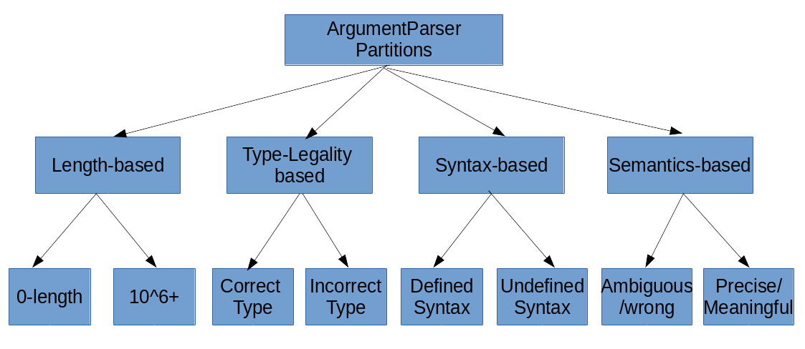

## Introduction
### 1. What is the tool that you are testing?
[Apache OpenNLP](https://opennlp.apache.org/)
### 2. What is its purpose?
From the [official website](https://opennlp.apache.org/):

> The Apache OpenNLP library is a machine learning based toolkit for the processing of natural language text.

### 3. Any other aspects that are relevant: size in terms of LOC, languages that it is written in, etc.
+ As of 24/04/2020, Totaling 194,800 lines of code (including test cases)
	+ *Java*, being the primary language, covers 124,736 lines (64%)
	+ *XML* is used for configuration and takes 64,651 lines (33%)
	+ *HTML/CSS/TEXT/SGML* files make up the rest of the codebase (3%)
+ JUnit is used as the testing framework
## Set Up
### 1. Fork your project into GitHub. Make it public (or, if you go private, add "jajones" as a collaborator).

Source available at: https://github.com/shrsv/opennlp-testing

### 2. Document its build. What did you need to do to get it built and running?


#### Intellij Idea

```
File -> Open -> Select Project root
Build -> Build Project
```

#### Terminal 

```
cd opennlp
mvn install
```


### 3. Document the existing test cases(JUnit or otherwise). This should be a study of the existing testing practices and frameworks that are used already in the system. (This section might evolve as we learn more throughout the quarter.) How do you run them?

+ Tests are located at **opennlp-tools/src/test/java/opennlp/tools**. 
+ Test cases are classified into 19 categories:
	+ chunker
	+ cmdline
	+ convert
	+ dictionary
	+ doccat
	+ eval
	+ formats
	+ langdetect
	+ languagemodel
	+ lemmatizer
	+ ml
	+ namefind
	+ ngram
	+ parser
	+ postag
	+ setndetect
	+ stemmer
	+ tokenize
	+ util
+ There are 861 JUnit test cases in total, majority of them are **unit tests**

#### Studying a sample test suite: ArgumentParserTest.java

+ All testcases are named in this format: `test*` which means the testing follows more of JUnit and TDD (Test Driven Development) conventions rather than BDD (Behavior Driven Development).
+ This file contains examples of both Functional and Non-Functional testing
	+**Functional test:** `testSimpleArguments`
		+ This function ensures ArgumentParser.parse works for the simple use case
		+ A bunch of assertEquals ensures the output meets expectations
	+**Non-functional test:** `testInvalidMethodName`
		+ A **"mock object"** is created with `ArgumentParser.createUsage`
		+ This mock-object is to be handled without crashing the system
		+ This mock-object raises an Exception, and JUnit is used to catch this exception
		+ **Reliability** property is ensured through this state
+ This file also contains examples of blackbox and whitebox testing types
	+ **Whitebox test:** The last example (non-functional test) is carried out with full-knowledge of the exception handling mechanism,
	+ **Blackbox test:** `testAllOptionalArgumentsOneArgument`takes a sample command line argument and runs it through the `ArgumentParser` class, and then compares the output with whatever is expected. Here, no knowledge of the application internals is assumed.

## Partitioning
### 1. First, motivate the need for systematic functional testing and partition testing.
+ The biggest advantage in partition testing is to reduce the overall number of tests that need to be performed.
	+ Once mutually exclusive partitions are found for the input, every partition can be validated through one (or very few) number of test cases
+ Functional testing, in a way, simulates what an end user might do. In functional testing, no knowledge of the system is assumed, which means, the input is provided and the given output is compared to expected output.
	+ This type of testing ensures that the software functions as expected despite changes (such as pieces of code getting removed!) going on various parts of the system  
### 2. Describe these concepts.
+ **Partition testing:** The lecture slides describe the partition principle as: "Exploit some knowledge to choose samples that are more likely to include "special" or trouble-prone regions of the input space" or, "Failures are sparse in the whole input space"
	+ In practice, this means checking "boundary conditions" for all kinds of variables
	+ The procedure to come up with partitions involves:
		+ Decomposing the specification to equivalence partitions
		+ Selecting represenatatives
		+ Form test specifications
		+ Produce and execute actual tests
+ **Functional testing:** The lecture slides define it so: "Deriving test cases from program specifications"
	+ Partitions can help in increasing the effectiveness (minimize time/effort spent, maximize bugs found)
### 3. Then, select a feature that allows for partitioning.
The `ArgumentParser` class deals with command line interface to OpenNLP. This can be tested through partition/functional testing methodologies.
### 4. Specify your partitions (and boundaries when appropriate) in English — describe them.



+ 4 types of partitions based on 4 properties:
	+ length-based:  
		+ length boundaries are: none & a large number (say 10^6)
		+ "normal" or expected length stay within above bounds
		+ *Example input:* argument = "" 
	+ type-legality: 
		+ arguments can be in the right type, or not
		+ that is, a set of inputs with type-mismatches and another without type-mismatches
		+ *Example input:* encoding = 123456 (a mismatch), encoding =  'UTF-8' (no mismatch)
	+ syntax-based: 
		+ an input with a syntax error or otherwise
		+ *Example input:* "--encoding = 'UTF-8'" (double hyphens are not allowed)
	+ semantics-based: 
		+ an input with "ambiguous" or "imprecise" meaning or otherwise
		+ *Example input: "-encoding en-GB"* is ambiguous because "en-GB" is a locale, not an encoding, although the two concepts are related

### 5. Then, write new test cases in JUnit, and describe and document those test cases and how they run.

The following test cases elaborate/concretize the cases specified in the previous section.


#### Length-based


Lower-bound:


	@Test(expected = IllegalArgumentException.class)
		public void testZeroLength() {
		String argsString = "";
		ArgumentParser.parse(argsString.split(""), SimpleArguments.class);
	}

  
  **RESULT: PASS**

Upper-bound:

	  @Test
	  public void testMillionLength(){
	    String argString = getAlphaNumericString(1000000);
	    // String argsString = "-encoding " + argString;
	    String argsString = "-encoding " + argString;
	    // ArgumentParser.validateArguments(argsString.split(" "), AllOptionalArguments.class);
	
	    Assert.assertFalse(ArgumentParser.validateArguments(argsString.split(" "), AllOptionalArguments.class));
	    // .assertTrue(ArgumentParser.validateArguments(argsString.split(" "), AllOptionalArguments.class));
	  }

  
  **RESULT: PASS**

#### Type-legality-based


	  @Test(expected = IllegalArgumentException.class)
	  public void testWrongType() {
	    String argsString = "-encoding UTF-8 -alphaNumOpt 23"; // should be a boolean
	    SimpleArguments args = ArgumentParser.parse(argsString.split(" "), SimpleArguments.class);
	    ArgumentParser.validateArguments(argsString.split(" "), SimpleArguments.class);
	    // BUG FOUND: validateArguments should ideally raise an error saying -alphaNumOpt type is
	    // wrong!
	    Assert.assertEquals(Integer.valueOf(100), args.getIterations());
	    Assert.assertEquals(null, args.getCutoff());
	    Assert.assertEquals(false, args.getAlphaNumOpt());
	  }
	
 **RESULT: FAIL**
 
#### Syntax-based


	  @Test(expected = IllegalArgumentException.class)
	  public void testIncorrectSyntax(){
	    String argsString = "-encoding UTF-8 --alphaNumOpt false"; // double hyphens (commonly confused)
	    SimpleArguments args = ArgumentParser.parse(argsString.split(" "), SimpleArguments.class);
	    ArgumentParser.validateArguments(argsString.split(" "), SimpleArguments.class);
	  }
	  
 
 **RESULT: PASS**
  
#### Semantics-based
  `

Ambiguous case:

	  @Test(expected = IllegalArgumentException.class)
	  public void testAmbiguousSemantics() {
	    String argsString = "-encoding en-GB"; // this encoding doesn't make sense, but the fault is not
	    // caught at the modular level
	    SimpleArguments args = ArgumentParser.parse(argsString.split(" "), SimpleArguments.class);
	    ArgumentParser.validateArguments(argsString.split(" "), SimpleArguments.class);
	  }
	}

**RESULT: FAIL**

Precise case:

	  @Test
	  public void testSimpleArguments() {
	    String argsString = "-encoding UTF-8 -alphaNumOpt false";
	    SimpleArguments args = ArgumentParser.parse(argsString.split(" "), SimpleArguments.class);
	
	    Assert.assertEquals("UTF-8", args.getEncoding());
	    Assert.assertEquals(Integer.valueOf(100), args.getIterations());
	    Assert.assertEquals(null, args.getCutoff());
	    Assert.assertEquals(false, args.getAlphaNumOpt());
	  }

**RESULT: PASS**