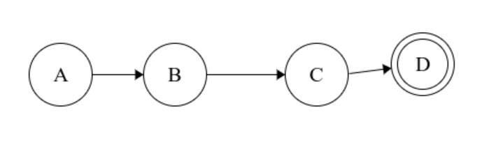
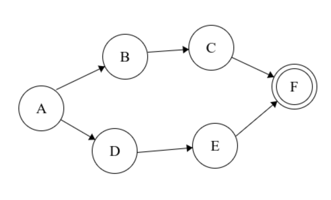
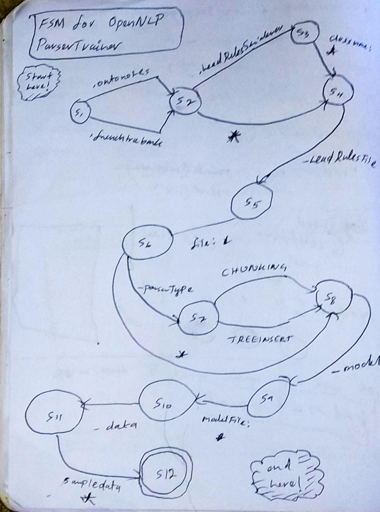

# Homework2: Functional models

## Describe how functional models can be useful for testing

Actual programs tend to be complex. The purpose of functional models is to have two properties:

1. Compact
2. Predictive

*Compact* means the program's (or a part/aspect of the program's) functionality is abstracted through some form of abstraction (ex: Finite State Machines) so that the overall content that needs to be examined to understand the system is smaller

*Predictive* means one can at least *approximately* be able to predict what the program will do given an input. This means the model is a "fair representation" of the complex program's specification.

## Choose a feature or component that lends itself well to being described by a non-trivial functional model.

OpenNLP's CLI parser can be modeled using Finite State Machine. The inspiration for my selecting this model is [mow.cli](https://jawher.me/2015/01/18/parsing-command-line-arguments-finite-state-machine-backtracking/).

## Describe your abstract functional model. Is is a standard functional model (e.g., a finite-state machine) or a custom model, created specifically to describe the functionality of your system?

I will be using FSMs to model OpenNLP's CLI parser, and it is a standard functional model. 

The problem of argument parsing is generally accomplished in an ad-hoc manner, but mow.cli in actuality implements a FSM based parser for this problem, which is a proof of concept that argument parsers can be represented through FSMs effectively. 

## Create, draw, and describe that concrete functional model, how it works, etc..

The key idea is that FSM are able to naturally represent various combinations of a given set of optional and mandatory arguments.

Mandatory arguments are represented as follows (in an AND structure):

1. A = Start State
2. A -> B Argument name (transition)
3. B = Intermediate state where arg name has been accepted
4. B -> C Argument value (transition)
5. C = Intermediate state where arg value has been accepted
6. C -> D Empty Space/New line
7. D = Final state (successful parse)

Optional arguments can be represented as an OR structure:

Here, there are two routes to a successful parse: ABCF or ADEF.

### A concrete example: OpenNLP ParserTrainer

Following is the commandline format for the parsertrainer tool. 

    Usage: opennlp ParserTrainer[.ontonotes|.frenchtreebank] [-headRulesSerializerImpl className] -headRules 
            headRulesFile [-parserType CHUNKING|TREEINSERT] [-fun true|false] [-params paramsFile] -lang language 
            -model modelFile [-encoding charsetName] -data sampleData 

This can be represented using an FSM in the following manner:

**Note:**

1. Here `*` = arbitrary text or empty space 
2. FSMs naturally accomodate optional/mandatory arguments, constants, and arbitrary text. 

## Write test cases (5 or more) that "cover" the functional model in JUnit. Describe in the document the test specification for each test case (i.e., what is each test case supposed to do/assure?), and then define those test cases in JUnit, which you will commit to your forked repository and push up to GitHub.

### Test 1

The model gurantees that mandatory arguments cannot be skipped. In this case we ensure the program errors out when the argument value for `-data` is missing.

    @Test()
    public void testMandatoryArgument() {
        // System.setSecurityManager(null);
        final ByteArrayOutputStream myOut = new ByteArrayOutputStream();
        System.setErr(new PrintStream(myOut));
        try {
            CLI.main(new String[]{"ParserTrainer", "-data"}); // madatory arg value for -data missing!
        } catch (Exception ex) {
            System.out.println("Caught exception");
        }
        final String standardErr = myOut.toString();
        System.out.println(standardErr);
        Boolean res = standardErr.contains("be always be even");
        Assert.assertEquals(true, res);
    }

**RESULT: PASS**

### Test 2

The model ensures that the arguments read are indeed valid, so this test ensures the program errors out when a datafile argument points to an non-existant file.

    @Test()
    public void testNonExistentDataFile() {
        // System.setSecurityManager(null);
        final ByteArrayOutputStream myOut = new ByteArrayOutputStream();
        System.setErr(new PrintStream(myOut));
        try {
            CLI.main(new String[]{"ParserTrainer", "-headRules", "headRulesFile", "-lang",
                    "English", "-model", "modelname", "-data", "sampledatafalse"});
            // the data file doesn't exist!
        } catch (Exception ex) {
            System.out.println("Caught exception");
        }
        final String standardErr = myOut.toString();
        System.out.println(standardErr);
        Boolean res = standardErr.contains("The Data file does not exist!");
        Assert.assertEquals(true, res);
    }

**RESULT: PASS**

### Test 3

Allowed `-parserType` values are `CHUNKING` or `TREEINSERT`. The model requires any other value to be unallowed. This test-case ensures this.

    @Test()
    public void testInvalidParserType() {
        // System.setSecurityManager(null);
        final ByteArrayOutputStream myOut = new ByteArrayOutputStream();
        System.setErr(new PrintStream(myOut));
        try {
            CLI.main(new String[]{"ParserTrainer", "-headRules", "headRulesFile", "-parserType",
                    "SampleModel", "-lang", "English", "-model", "modelname", "-data", "sampledata"});
        } catch (Exception ex) {
            System.out.println("Caught exception");
        }
        final String standardErr = myOut.toString();
        System.out.println(standardErr);
        Boolean res = standardErr.contains("is invalid");
        Assert.assertEquals(true, res);
    }

**RESULT: PASS**

### Test 4

This is the opposite of previous case, to ensure when a valid parser type is used, the CLI accepts it.

    @Test()
    public void testValidParserType() {
        // System.setSecurityManager(null);
        final ByteArrayOutputStream myOut = new ByteArrayOutputStream();
        System.setErr(new PrintStream(myOut));
        try {
            CLI.main(new String[]{"ParserTrainer", "-headRules", "headRulesFile", "-parserType",
                    "TREEINSERT", "-lang", "English", "-model", "", "-data", "sampledata"});
            // a valid set of arguments; should be accepted
        } catch (Exception ex) {
            System.out.println("Caught exception");
        }
        final String standardErr = myOut.toString();
        Boolean res = standardErr.contains("is invalid");
        Assert.assertEquals(false, res);
    }

**RESULT: PASS**

### Test 5

The model ensures that only valid arguments can be provided. This time we try supplying a fake argument, and ensure the program avoids further processing.

    @Test
    public void testAdditionalParams() {
        // System.setSecurityManager(null);
        final ByteArrayOutputStream myOut = new ByteArrayOutputStream();
        System.setErr(new PrintStream(myOut));
        try {
            CLI.main(new String[]{"ParserTrainer", "-headRules", "headRulesFile", "-parserType", "TREEINSERT",
                    "-lang", "English", "-model", "", "-data", "sampledata", "-fakearg", "fakevalue"});
            // fake/unrecognizable arguments added
        } catch (Exception ex) {
            System.out.println("Caught exception");
        }
        final String standardErr = myOut.toString();
        Boolean res = standardErr.contains("Unrecognized parameters");
        Assert.assertEquals(true, res);
    }

**RESULT: PASS**